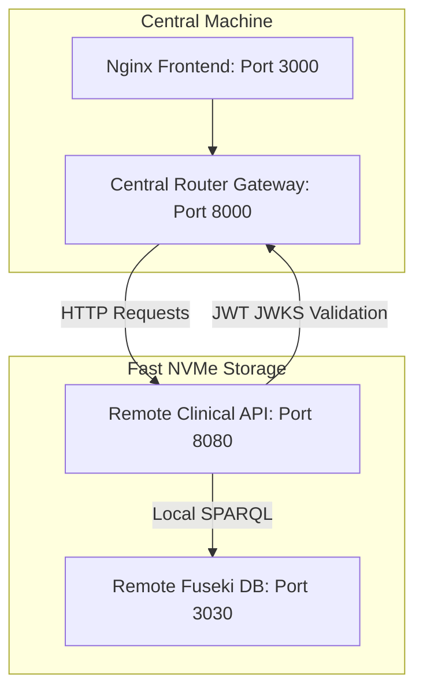

# Remote Database Slice Deployment Guide (Option 1)

This guide details the steps required to deploy specialized database instances (Jena Fuseki + specialized API) on a separate remote server (e.g. server with faster/larger storage) while keeping a single, centralized Central Router Gateway and Frontend stack.

---

## Architecture Overview



---

## Setup Steps

### Step 1: Deploy Database Slice on the Remote Server
On the remote server that holds the fast/large storage:

1. Create a workspace directory (e.g. `fairgraph-slice`).
2. Save the following minimal `docker-compose.yml` file:

```yaml
version: '3.8'

services:
  clinical_fuseki:
    image: frnzdock/fairgraph-fuseki:latest
    container_name: clinical_fuseki_db
    ports:
      - "3030:3030" # Optional: allows local SPARQL inspection on remote server
    volumes:
      - clinical_fuseki-data:/fuseki
    # Uses mem query engine or configured config.ttl
    command: [ "/jena-fuseki/fuseki-server", "--mem", "/ds" ]
    healthcheck:
      test: [ "CMD-SHELL", "wget --no-verbose --tries=1 --spider http://127.0.0.1:3030/ || exit 1" ]
      interval: 10s
      timeout: 3s
      retries: 30

  clinical_api:
    image: frnzdock/fairgraph-api:latest
    container_name: clinical_api
    ports:
      - "8080:8000" # Expose the API port to your network (e.g. 8080)
    environment:
      - FUSEKI_BASE_URL=http://clinical_fuseki:3030/ds
      - ADMIN_PASSWORD=admin
      - VOCAB_PATH=./vocabulary/clinical_vocabulary.ttl
      - AUTH_MODE=oidc
      # CRITICAL: Point validation requests back to the Central Router Gateway IP
      - OIDC_JWKS_URL=http://<YOUR-CENTRAL-ROUTER-IP>:8000/.well-known/jwks.json
      - OIDC_ISSUER_URL=http://localhost:8000
    depends_on:
      clinical_fuseki:
        condition: service_healthy

volumes:
  clinical_fuseki-data:
```

3. Replace `<YOUR-CENTRAL-ROUTER-IP>` with the public or private LAN IP address of the machine hosting the Central Router.
4. Run:
   ```bash
   docker compose up -d
   ```

---

### Step 2: Configure the Central Router Gateway
On the primary machine hosting your Central Router and Frontend:

1. Open your Central Router `.env` file (or docker-compose file) and modify the clinical instance environment mapping to point to the remote server IP:

```env
INSTANCE_CLINICAL_URL=http://<REMOTE-SERVER-IP>:8080
```

2. Restart the local central router service to pick up the changes:
   ```bash
   docker compose up -d central_router
   ```

---

### Step 3: Validation and Verification

1. **Verify Connectivity**:
   - Access the local browser UI on `http://localhost:3000`.
   - Go to the **Import Wizard** page (or run the `upload_all.py` script locally).
   - Ingest a sample clinical template and CSV dataset.
   
2. **Confirm Remote Storage Ingestion**:
   - Log into the remote storage server.
   - Run a SPARQL query or inspect the Fuseki logs on the remote machine to verify that the triples were successfully written to the local remote volume.
